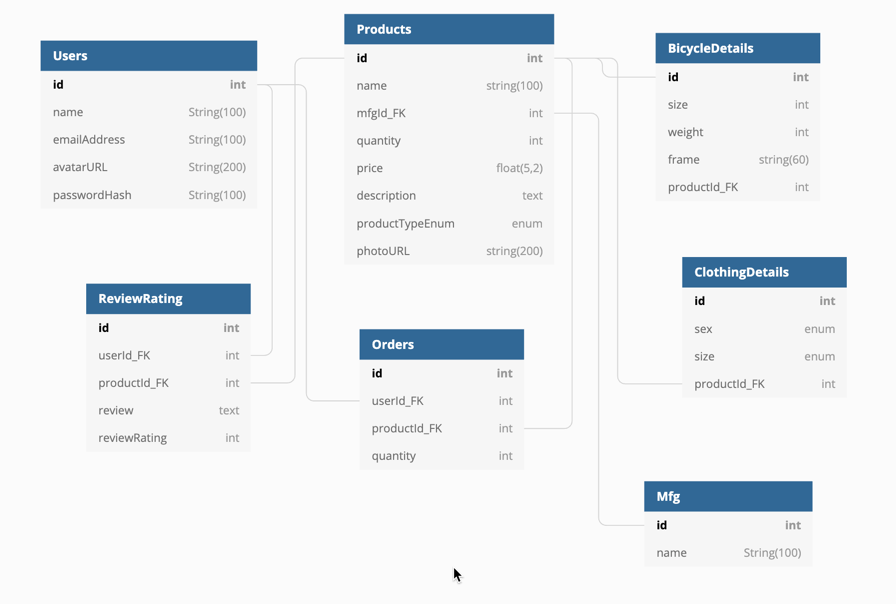

# CF - Riders

# Technical Documentation

##Images

Images are stored on https://marylark.imgur.com/all.  In implementing product uploads, I would have to open up a public directory on the backend for uploads, as well as provide endpoints to the uploads.  Due to time limitations and implementation details, I've chosen to use imgur to host images.  I simply reference the imgur direct URL for the images in the front-end.

##Database Model

The following details the database model used in the CF - Riders website.  This model will accommodate for Users registering, voting, and viewing products and product detail pages.



```
Table Products {
  id int [pk, increment]
  name string(100)
  mfgId_FK int
  quantity int
  price float(5,2)
  description text
  productTypeEnum enum ('Bicycles', 'Clothing', 'Accessories')
  photoURL string(200)
}
Ref: Products.mfgId_FK - Mfg.id


Table Mfg {
  id int [pk, increment]
  name String(100)
}


Table BicycleDetails {
  id int [pk, increment]
  size int
  weight int 
  frame string(60)
  productId_FK int 
}
Ref: BicycleDetails.id - Products.id


Table ClothingDetails {
  id int [pk, increment]
  sex enum ('M', 'F')
  size enum ('XS', 'S', 'M', 'L', 'XL', 'XXL', 'XXXL')
  productId_FK int
}
Ref: ClothingDetails.productId_FK - Products.id

Table ReviewRating {
  id int [pk, increment]
  userId_FK int
  productId_FK int
  review text
  reviewRating int
}
Ref: ReviewRating.userId_FK - Users.id
Ref: ReviewRating.productId_FK > Products.id

Table Users {
  id int [pk, increment]
  name String(100)
  emailAddress String(100)
  avatarURL String(200)
  passwordHash String(100)
}

Table Orders {
  id int [pk, increment]
  userId_FK int
  productId_FK int
  quantity int 
}
Ref: Orders.userId_FK > Users.id
Ref: Orders.productId_FK > Products.id

```

## BackEnd Routes

To accomodate accessing the database and providing user security, the following backend routes will be needed:

1. **'/' : GET :** This route will provide the home page product information.  No authentication/authorization will be done at this time to access this information.  However, we will examine the user's token to make certain it has not been intercepted by nefarious beings.
2. **'/login' : GET :**  This route will setup the authorization needed for the user to provide reviews for products, as well as update the navigation with the user's avatar and login status.
3. **'/products/:type' : GET :** This route will process the request for product listings by types and return the products page for the requested product type.
4. **'/products/:id' : GET :** This route will process the request for the individual request for specific product types.
5. **'/products/:id/reviews' : GET :** This route will process the request for reviews based on an individual product id.
6. **'/products/:id/reviews' : PUT :** This route will authenticate the user, and create a new review and store that review and rating in the database.
7. **'/signup' : PUT :** This route will check that the user does not currently exist via email address, validate the passwords conform to the password length and other checks, and will update the database with the user's user token, hashedPassword, email address, avatar URL, and name.  The JSON returned will be the user's avatar URL, and the user's first name, as well as the session token.
8. **'/order' : PUT :** This route will check that the user is logged in, then verify that their is appropriate stock available for each item.  The return value will be a success value.  The stock quantity will be updated in the database.    The user's order will be created in the database in order to show history.
